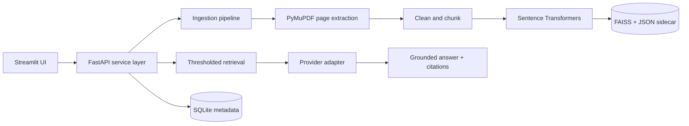

# AI Research Paper Intelligence Platform

An end-to-end research assistant for uploading, indexing, searching, questioning, summarizing, and comparing multiple research-paper PDFs. It demonstrates page-aware document processing, embeddings, FAISS retrieval, grounded RAG, structured metadata, evaluation, a FastAPI backend, and a Streamlit workspace.

## Architecture



## RAG workflow

PDF bytes are validated, hashed, stored, extracted page by page, cleaned, and split into overlapping chunks. Each chunk retains document ID, filename, page, chunk ID, and source text. Query embeddings are compared with normalized inner product in FAISS. Results below the configured threshold are discarded. The LLM receives only the retrieved context and is required to state when evidence is missing; citations are constructed from retrieved chunks rather than generated text.

## Features

- Multi-file PDF upload, safe filenames, size/type validation, SHA-256 duplicate detection, and deletion.
- Page-aware chunking and structured `PaperMetadata` models.
- Sentence Transformers embeddings with an offline TF-IDF fallback.
- Persistent FAISS index and metadata sidecar.
- Semantic search with configurable top-k and threshold.
- Modular mock/OpenAI LLM providers, grounded QA, citations, and missing-evidence fallback.
- Structured summaries, paper comparison table, analytics, SQLite query history.
- Evaluation metrics for retrieval relevance, context precision/recall, and citation correctness.
- FastAPI endpoints and Streamlit UI.

## Setup

```powershell
python -m venv .venv
.\.venv\Scripts\Activate.ps1
python -m pip install -r requirements.txt
Copy-Item .env.example .env
```

The default `LLM_PROVIDER=mock` runs without a key. For generated answers, set `LLM_PROVIDER=openai` and `OPENAI_API_KEY` in `.env`. No key is committed.

## Run

```powershell
streamlit run frontend/streamlit_app.py
uvicorn app.main:app --reload
pytest -q
```

Or with Docker:

```powershell
docker compose up --build
```

## Environment variables

`DATA_DIR`, `EMBEDDING_MODEL`, `LLM_PROVIDER`, `LLM_MODEL`, `OPENAI_API_KEY`, `RETRIEVAL_TOP_K`, `RETRIEVAL_THRESHOLD`, and `MAX_UPLOAD_MB` are supported. See `.env.example` for defaults.

## Evaluation methodology

`evaluation/dataset.json` is the seed labeled set. For each question, expected source chunk IDs are compared with retrieved IDs. Context precision measures the fraction of retrieved chunks that are relevant; context recall measures the fraction of relevant chunks retrieved. Citation correctness checks that cited IDs exist among retrieved sources. Faithfulness should be reviewed with human or model-graded answer claims against the supplied context; production deployments should expand the labeled set and report confidence intervals.

## Limitations and future improvements

The default extractor does not OCR scanned PDFs, metadata extraction is intentionally conservative, and the mock provider does not synthesize answers. Production improvements include OCR, section-aware chunking, reranking, hybrid BM25/vector retrieval, PostgreSQL/pgvector, background jobs, authentication, object storage, observability, and a larger expert-labeled evaluation set.

## Interview discussion points

- **Why RAG?** It grounds answers in changing private documents without retraining a model.
- **Why embeddings and FAISS?** Embeddings capture semantic similarity; FAISS provides fast local nearest-neighbor search and can later be replaced by a managed vector database.
- **How are hallucinations reduced?** Thresholding, top-k limits, context-only prompts, explicit missing-information fallback, and citations.
- **How would this scale?** Separate ingestion workers, object storage, PostgreSQL/pgvector, reranking, cached embeddings, and an authenticated API.
- **Why Streamlit and FastAPI?** Streamlit accelerates an analyst-facing workflow; FastAPI provides a typed, independently deployable service boundary.
